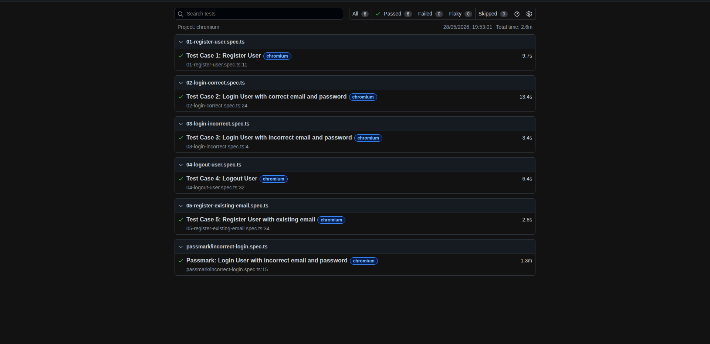

# automationexercise.com — Playwright Test Suite

A Playwright + TypeScript suite that automates the top 5 test cases from
[automationexercise.com/test_cases](https://automationexercise.com/test_cases),
plus a bonus spec that re-implements one of the tests using
[Passmark](https://github.com/bug0inc/passmark), Bug0's open-source AI
testing library.

## Tests

| #   | Spec                                            | Scenario                                  |
| --- | ----------------------------------------------- | ----------------------------------------- |
| 1   | `tests/01-register-user.spec.ts`                | Register a new user end-to-end and delete the account |
| 2   | `tests/02-login-correct.spec.ts`                | Log in with valid credentials             |
| 3   | `tests/03-login-incorrect.spec.ts`              | Log in with invalid credentials → error message |
| 4   | `tests/04-logout-user.spec.ts`                  | Log in, log out, land back on the login page |
| 5   | `tests/05-register-existing-email.spec.ts`      | Sign up with an already-registered email → error message |
| 6   | `tests/passmark/incorrect-login.spec.ts`        | Test #3 re-implemented with Passmark's natural-language steps |

Each spec that needs an account creates a fresh one in `beforeAll` and cleans
up in `afterAll`, so the suite is fully self-contained and re-runnable.

## Prerequisites

- Node.js 18+
- npm 9+

## Install

```bash
npm install
npx playwright install chromium
```

## Run

```bash
# All tests (5 core + 1 Passmark)
npx playwright test

# Just the 5 core specs
npx playwright test --grep-invert "Passmark"

# Just the Passmark spec
npm run test:passmark

# Open the HTML report after a run
npm run report
```

## Environment

| Variable             | Required for          | Description |
| -------------------- | --------------------- | ----------- |
| `OPENROUTER_API_KEY` | `tests/passmark` only | OpenRouter API key. Passmark routes model calls through it. The 5 core specs do not need this. |

Copy `.env.example` to `.env` and fill in your key. When `OPENROUTER_API_KEY`
is not set, the Passmark spec is automatically skipped — the core 5 still pass.

## Project layout

```
playwright.config.ts        # chromium project, retries, dotenv
tests/
  helpers/user.ts           # randomUser(), signUp(), login(), logout(), deleteAccount()
  01-register-user.spec.ts
  02-login-correct.spec.ts
  03-login-incorrect.spec.ts
  04-logout-user.spec.ts
  05-register-existing-email.spec.ts
  passmark/
    incorrect-login.spec.ts # Passmark version of Test 3
screenshots/                # Place your `5 passed` screenshot here
```

## Notes

- The suite runs serially (`workers: 1`) and `fullyParallel: false`, because
  it talks to a live shared third-party site (automationexercise.com).
- Locators prefer `data-qa` attributes (provided by the site) and Playwright's
  `getByText` / `getByRole` over brittle CSS — see
  [Playwright codegen guidance](https://playwright.dev/docs/codegen).
- Random emails (`auto_<timestamp>_<rand>@example.com`) prevent
  cross-run collisions.

## Test Results


